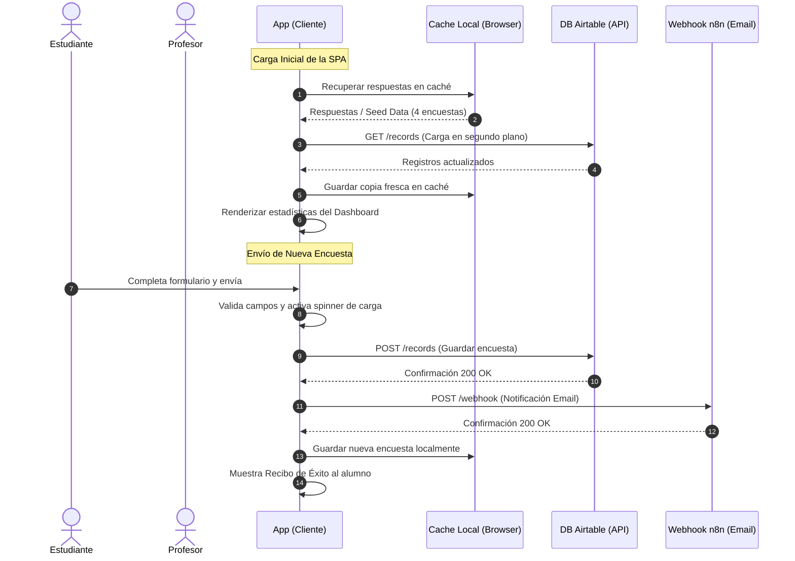

# Reporte de Análisis Técnico: Sistema de Encuestas Antigravity (Student Feedback Hub)

Este documento presenta un análisis exhaustivo y profesional del estado actual del **Sistema de Encuestas Antigravity**, evaluando su arquitectura, calidad de código, experiencia de usuario (UI/UX) y postura de seguridad.

---

## 📊 1. Resumen Ejecutivo
El proyecto es una aplicación de página única (**SPA**) altamente interactiva construida con tecnologías web puras (**HTML5, CSS3, ES6 JavaScript**). Cuenta con una estética ciberpunk futurista premium con una paleta de color basada en **negro, rojo y amarillo neón**, implementando efectos visuales modernos como *glassmorphism* y animaciones sutiles.

La lógica de negocio integra:
1. **Persistencia Híbrida**: Sincronización en tiempo real con una base de datos remota en **Airtable** combinada con caché de alto rendimiento y fallback local vía **LocalStorage**.
2. **Notificaciones Automatizadas**: Disparo asíncrono de un webhook en **n8n** para el envío de correos electrónicos a los docentes al finalizar cada encuesta.
3. **Panel de Control (Dashboard) Protegido**: Un panel analítico con métricas clave recopiladas en vivo, gráficos CSS interactivos, tabla de respuestas filtrada, exportador a JSON y un gestor de errores autolimpiable.

---

## 📂 2. Arquitectura y Estructura del Proyecto

El proyecto está diseñado bajo un enfoque minimalista y de cero dependencias en compilación, lo que facilita enormemente su despliegue y desarrollo ágil:

```text
GA_S8_ProyectoEncuesta/
├── index.html           # Estructura semántica (SPA), maquetación de formularios y modales.
├── style.css            # Hoja de estilos premium. Sistema de diseño responsivo basado en CSS Variables.
├── app.js               # Motor lógico: sincronización de APIs, control de flujo, autenticación y analítica.
├── encuesta.txt         # Bitácora histórica con prompts de requerimientos, especificaciones y API keys.
└── README.md            # Guía del usuario y documentación oficial del proyecto.
```

### Flujo de Datos
El siguiente diagrama detalla la interacción entre el cliente (navegador) y los servicios externos:



---

## 🎨 3. Análisis de UI/UX y Estética Visual

### Fortalezas Visuales
* **Paleta de Colores Curada**: La combinación de fondo negro profundo (`#08080b`), acentos rojo neón (`#ff2e63`) y amarillo ciberpunk (`#ffc93c`) crea un impacto visual inmediato.
* **Micro-interacciones Premium**:
  * Los selectores circulares de la escala 1-5 se iluminan de forma dinámica (los valores 4 y 5 se tiñen de amarillo cálido y los valores inferiores de rojo neón al seleccionarse).
  * Hover dinámico en tarjetas y botones con elevación y sombras neón difusas (`box-shadow`).
  * Los orbes de brillo en el fondo (`glow-orb`) confieren profundidad visual a la interfaz.
* **Diseño Responsivo**: Grid y flex layouts que adaptan perfectamente el formulario, tablas y tarjetas analíticas a terminales móviles.

### Puntos de Mejora
* **Accesibilidad (a11y)**: El contraste de textos grises (`--color-text-muted: #8e95a5`) sobre el fondo oscuro está en el límite de los estándares WCAG AA. Se recomienda incrementar levemente su brillo para mejorar la legibilidad.
* **Interactividad en los Gráficos**: Aunque las barras de progreso animadas en CSS lucen excelentes, no muestran un desglose detallado al pasar el ratón por encima (ej. cuántos alumnos votaron con 5 estrellas, 4 estrellas, etc.).

---

## 💻 4. Análisis de Código y Robustez Técnica (`app.js`)

### Aspectos Destacados
1. **Prevención de Inyecciones (XSS)**: Implementación de la función `escapeHTML` antes de inyectar los datos en el DOM, sanitizando entradas potencialmente dañinas escritas por los estudiantes.
2. **Prevención de Spam (Rate Limiting)**: Sistema de enfriamiento (`SUBMISSION_COOLDOWN_MS` de 5 minutos) en el LocalStorage que bloquea reenvíos accidentales o ataques de spam del mismo estudiante.
3. **Resiliencia ante Fallos**: Si la API de Airtable está caída, bloqueada por CORS o sin red, la aplicación realiza un *graceful degradation* recurriendo a las respuestas del LocalStorage y registrando los detalles técnicos en un agregador de errores histórico.
4. **Utilidades Docentes**: Capacidad de exportar la base de datos descargada directamente a formato JSON y descargar el histórico de logs en formato `.txt` estructurado para depuración rápida.

---

## 🔒 5. Análisis Crítico de Seguridad (Vulnerabilidades Encontradas)

Siguiendo la solicitud de análisis de brechas de seguridad presente en `encuesta.txt`, se identifican los siguientes riesgos críticos de seguridad debido al diseño puramente *Front-End* de la aplicación:

### 🚨 Riesgo 1: Exposición de Credenciales Privadas (Airtable PAT)
* **Ubicación**: `app.js` (Líneas 10 y 11).
* **Detalle**: El token de acceso personal (PAT) de Airtable está hardcodeado e incrustado en el JavaScript del cliente. Aunque se dividió en dos cadenas para dificultar análisis estáticos simples, cualquier atacante o estudiante con conocimientos de desarrollo web puede abrir las herramientas del desarrollador (DevTools -> Sources/Console), recomponer la cadena `_aTokenPart1` y `_aTokenPart2` y obtener acceso completo de lectura y escritura a la base de datos completa de Airtable.
* **Consecuencias**: Robo de datos de la base, borrado de registros, inserción masiva de SPAM en la base de datos y consumo del límite de peticiones de la API.

### 🚨 Riesgo 2: Exposición del Webhook de n8n
* **Ubicación**: `app.js` (Líneas 12 y 13).
* **Detalle**: La URL completa del webhook de pruebas de n8n es visible para cualquiera.
* **Consecuencias**: Envío masivo de correos falsos (Email Spamming) disparando directamente el webhook con cargas arbitrarias de JSON desde herramientas como Postman.

### 🚨 Riesgo 3: Autenticación por PIN Vulnerable en el Cliente
* **Ubicación**: `app.js` (Líneas 16 y 293).
* **Detalle**: El PIN de acceso para visualizar el panel de control (`Antigravity2026`) está hardcodeado en texto plano en la variable `ADMIN_ACCESS_PIN`. Adicionalmente, el estado de sesión `isAuthenticated` es global.
* **Consecuencias**: Cualquier usuario puede saltarse la autenticación escribiendo en la consola del navegador `isAuthenticated = true; switchTab('dashboard');` o simplemente leyendo el código fuente para averiguar la clave en 5 segundos.

---

## 🛠️ 6. Plan de Acción y Mejoras Recomendadas

Para elevar este proyecto a un estándar de producción empresarial y resolver las brechas críticas de seguridad detectadas, se recomiendan las siguientes mejoras estructuradas por prioridad:

### Fase 1: Blindaje de Credenciales con un Proxy / Serverless Backend (Prioridad Alta)
La regla de oro de la seguridad web es: **Nunca expongas claves privadas en el navegador del cliente**.

1. **Creación de Funciones Serverless (ej. Netlify/Vercel Functions o Firebase Cloud Functions)**:
   * Crear un microservicio intermedio muy simple que actúe de proxy.
   * El navegador del cliente enviará las respuestas únicamente a una ruta de nuestro servidor, por ejemplo: `POST /api/submit-survey`.
   * El backend proxy recibirá la encuesta, validará los campos y leerá el Token de Airtable y el Webhook de n8n desde **Variables de Entorno del Servidor** (`process.env.AIRTABLE_PAT`), manteniéndolas 100% ocultas del cliente final.
2. **Autenticación Docente Robusta**:
   * Migrar la verificación del PIN al backend. Al ingresar el PIN en la pantalla, este se envía al backend para ser validado. Si es correcto, el servidor devuelve un token de sesión temporal firmado (ej. **JWT**). Las peticiones del Panel de Control deberán incluir este token para poder descargar datos reales de Airtable.

### Fase 2: Robustez de la Base de Datos y Redundancia (Prioridad Media)
1. **Límites de Entrada en Airtable**: Configurar permisos de API granulares en la consola de Airtable (ej. crear un token que sea **únicamente de escritura** para la encuesta del alumno y otro token **únicamente de lectura** para el panel del profesor).
2. **Sanitización del Lado del Servidor**: Aunque `escapeHTML` es excelente en el cliente, un atacante puede omitir la interfaz web y enviar código malicioso directamente a la API de Airtable. Es vital re-validar y sanitizar la entrada dentro del backend.

### Fase 3: Mejoras de Usabilidad y Accesibilidad (Prioridad Baja)
1. **Cumplimiento WCAG 2.1**: Aumentar la luminosidad de los textos grisáceos secundarios de `#8e95a5` a un tono como `#b3bac7` para garantizar que personas con dificultades visuales lean el formulario cómodamente.
2. **Visualización de Datos**: Integrar una pequeña librería gráfica de alto rendimiento como **Chart.js** o **ApexCharts** para sustituir los gráficos de barra estáticos de CSS por un dashboard interactivo de distribución de votos (ej. un gráfico de pastel o barras desglosadas por puntuación).

---

## 🔍 7. Conclusión
El **Sistema de Encuestas Antigravity** destaca como un desarrollo sobresaliente en cuanto a su diseño visual y lógica interactiva en el lado del cliente. Su integración con Airtable y n8n demuestra un gran dominio de los flujos asíncronos y arquitecturas orientadas a eventos.

Al implementar la arquitectura de **Proxy Serverless** descrita en el Plan de Acción, el proyecto no solo lucirá espectacular en el exterior, sino que será impecable y robusto por dentro, listo para ser desplegado en producción a gran escala.
